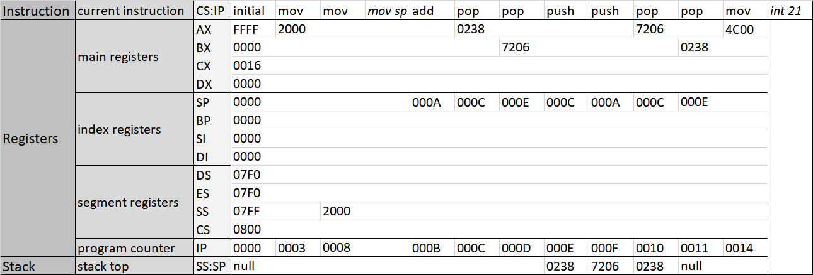

# Programming, Compiling, Linking and Debugging: 1st self-written program
## Requirements
- MASM.EXE: Microsoft(R) Macro Assembler 
- LINK.EXE: Microsoft(R) Overlay Linker
- EDIT.COM (optional): MS-DOS Editor
You can download debugging toolchain, including the programs mentioned above, from my Baidu netdisk:
```
URL：https://pan.baidu.com/s/1AB4HHXveXFZkHZJlRCpMgA 
passcode：nfyj
```
## Configuration
Move the required programs into the disk which you mounted in DOSBox.
## Result
### Tracking Execution

### Observing [PSP](https://en.wikipedia.org/wiki/Program_Segment_Prefix)
